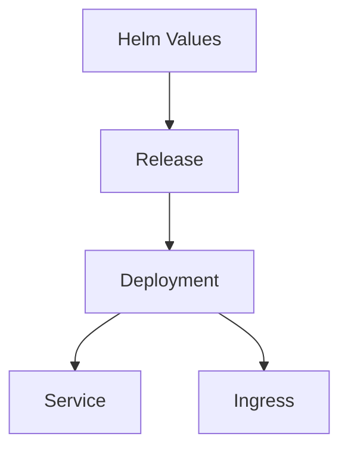

# Kubernetes Helm Platform

This repository delivers reusable Helm chart patterns for AKS and Kubernetes workloads, enabling repeatable deployment and platform consistency.

```mermaid
flowchart TD
    A[Helm Values] --> B[Release]
    B --> C[Deployment]
    C --> D[Service]
    C --> E[Ingress]
```
